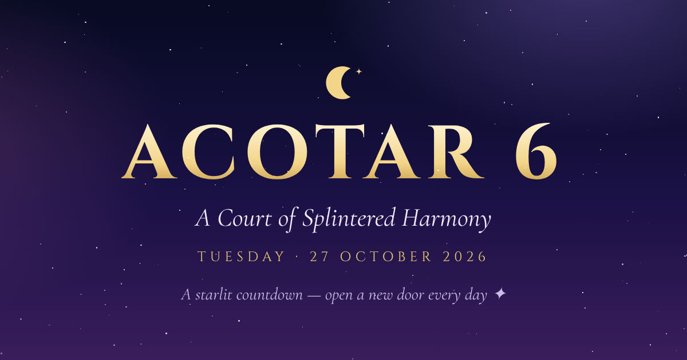
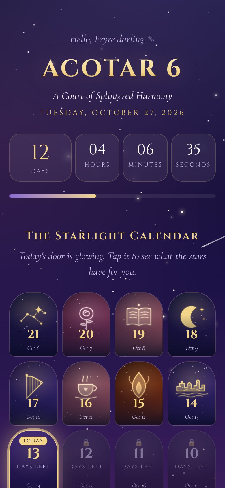
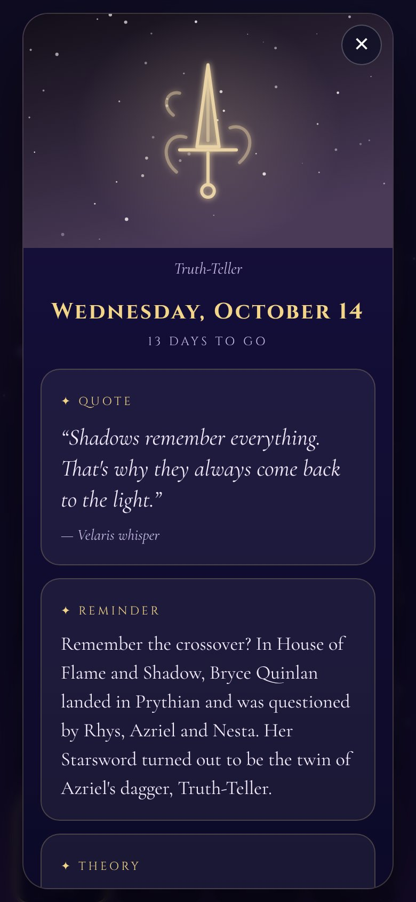

<div align="center">



# ✨ ACOTAR 6 Countdown

**A starlit countdown and daily advent calendar for _A Court of Splintered Harmony_, out Tuesday 27 October 2026.**

[**Open the countdown →**](https://idevelopes.github.io/acotar-countdown/)

</div>

---

Waiting for the next *A Court of Thorns and Roses* book is easier with something to open every day.
From 6 October until release day, a new door unlocks each morning. Behind each one is a little piece of Prythian.

<p align="center">
  
  &nbsp;&nbsp;
  
</p>

## Behind every door

| | |
|---|---|
| 🎨 **Artwork** | A hand-drawn illustration for each day: the Night Court moon, Illyrian wings, Truth-Teller, the Velaris skyline, the House of Wind and more |
| 💬 **Quote** | A line from the books, or a fan-made "Velaris whisper" |
| 📌 **Reminder** | A recap to refresh your memory before the new book, or a release-day prep task |
| 🔮 **Theory** | A fan theory to vote on: 🔥 believe it, 🤔 maybe, or 🙅 never |

## Features

- **Live countdown** to the second, with a progress bar
- **22-door advent calendar.** Future doors stay locked (try tapping one), and opened doors remember themselves.
- **Your name in the stars.** You're asked your name on the first visit and greeted with "Hello, ___ darling" after that. Tap the greeting to change it.
- **Gift links.** Counting down with someone? The footer makes a link with their name in it (`?name=Trisha`), so they're greeted by name straight away.
- **Release-day starfall,** with a reminder that book 7 follows on 12 January 2027
- **Works like an app.** On a phone, use **Share → Add to Home Screen**.
- **Private by design.** No accounts, cookies or analytics. Your name, opened doors and votes stay in your own browser.

## Spoilers?

None for book 6. The content draws on the published books (ACOTAR to ACOSF), the *Crescent City* crossover
in *House of Flame and Shadow*, and the official *A Court of Splintered Harmony* blurb.
Reminders and theories assume you've read those.

---

## For developers

It's plain HTML, CSS and JavaScript with no build step and no dependencies.

```
index.html             page structure
styles.css             all styling
app.js                 countdown, calendar, artwork, name and gift-link logic
content.js             all the text: dates, quotes, reminders, theories
og-image.png           link-preview image
docs/                  README screenshots
```

**Run locally:** open `index.html` in a browser, or serve the folder with any static server.

**Preview a future day:** add `?date=YYYY-MM-DD`, for example `?date=2026-10-27` for release day.
Doors opened while previewing are saved as opened in that browser, so use a private window.

**Edit the content** in `content.js`:

- `CONFIG`: the dates, the title, and a fallback name
- `DAYS`: one entry per day, in order. The last entry is release day.
- `art.icon`: `moon`, `constellation`, `rose`, `sun`, `snowflake`, `leaf`, `wings`, `book`, `crown`, `harp`, `mask`,
  `dagger`, `mountain`, `skyline`, `teacup`, `candle`, `cauldron`, `heart`, `feather`, `flame`, `hourglass`, `starfall`
- `art.palette`: `night`, `velaris`, `starfall`, `spring`, `autumn`, `winter`, `day`, `dawn`, `illyrian`

**Deploy with GitHub Pages:** go to **Settings → Pages → Deploy from a branch** and choose `main` and `/ (root)`.
If you host somewhere else, update the `og:url` and `og:image` links in `index.html` so link previews still work.

---

<div align="center">

<sub>Fan-made with love 💜 Not affiliated with Sarah J. Maas or Bloomsbury.<br/>
Short quotes are from the <i>A Court of Thorns and Roses</i> series and remain the property of their author.</sub>

<br/><br/>

*Night Triumphant — and the Stars Eternal.*

</div>
